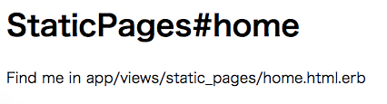

# railsHerokuStart

railsで作ったアプリをHerokuに乗せるまでのよくやる設定

- 雛形作成

```
$ APP_NAME=railsHerokuStart
$ rails new ${APP_NAME}
$ cd ${APP_NAME}
$ git add -A
$ git commit -m 'rails new'
```

- 静的ページの生成

```
$ rails generate controller StaticPages home
```

- routes編集

config/routes.rb

2行目に追加
```
root 'static_pages#home'
```

- スマホ対応

app/views/layouts/application.html.erb

headerタグ内に追加

```
<meta name="viewport" content="width=device-width, initial-scale=1">
```

- herokuで使用するDBをpostgresに変更

※ローカルで使用するDBはsqliteのままにする

Gemfile

```
# Use sqlite3 as the database for Active Record
gem 'sqlite3'
```

↓

```
# Use sqlite3 as the database for Active Record
gem 'sqlite3', group: :development
# 本番ではpostgressを使用する
gem 'pg', group: :production
```

- ローカルでの動作確認

```
$ rails s
```

[http://0.0.0.0:3000](http://0.0.0.0:3000)



- コミット&デプロイ

```
$ git add -A
$ git commit -m 'add root page'

$ APP_NAME_HEROKU=yf-rails-heroku-start
$ heroku create ${APP_NAME_HEROKU}
```